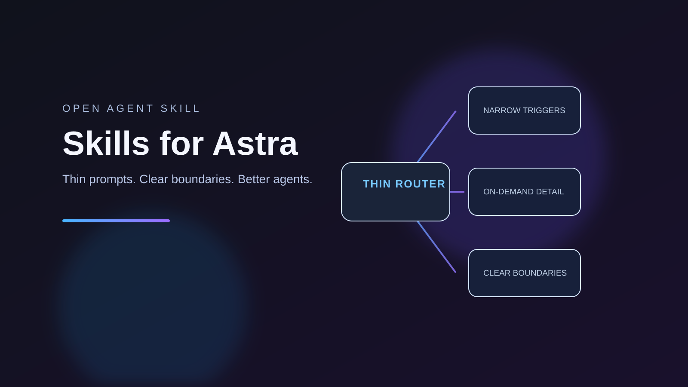

# Skills for Astra

[](https://www.skills.sh/chengyixu/skills-for-astra/skills-for-astra)

A small agent skill for cleaning up the instruction surface around `SKILL.md`,
`AGENTS.md`, and `CLAUDE.md` files.

It helps an agent reduce context pressure without deleting specialist knowledge:
keep discovery descriptions narrow, make detail progressive, preserve
on-demand workflows, and scope side effects explicitly.



## Install

```bash
npx skills add chengyixu/skills-for-astra
```

Or copy this repository into a compatible agent's skill directory.

Browse it on [skills.sh](https://www.skills.sh/chengyixu/skills-for-astra/skills-for-astra). SkillsMP ingests public GitHub `SKILL.md` repositories automatically; its search index can lag new GitHub publications.

## What it checks

- descriptions that are too broad or too long;
- recursive skill bundles that bypass an active-skill budget;
- duplicate names and incompatible installation paths;
- bloated global instructions and stale tool assumptions;
- separation of active policy from vendor caches and templates.

## Package layout

- `SKILL.md` — concise entrypoint and decision boundaries.
- `references/audit-checklist.md` — full audit procedure, loaded only when needed.
- `assets/skills-for-astra-promo.svg` — launch/social card.

## Naming and claims

“Skills for Astra” is a package name. It is not affiliated with, endorsed by,
or a compatibility claim about any model provider or product.

## License

MIT
